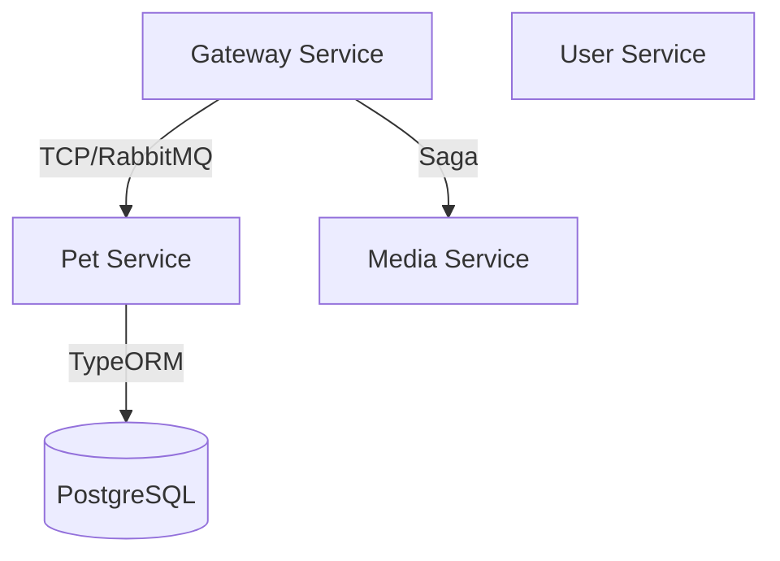
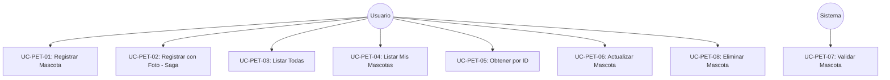
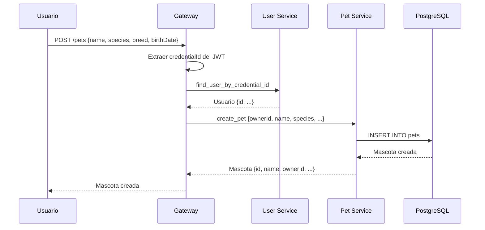
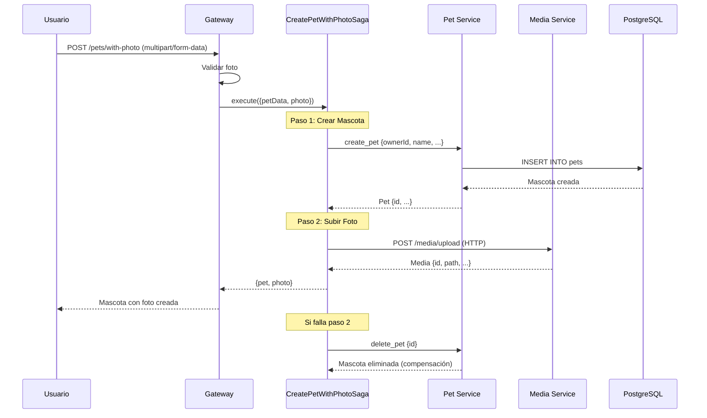
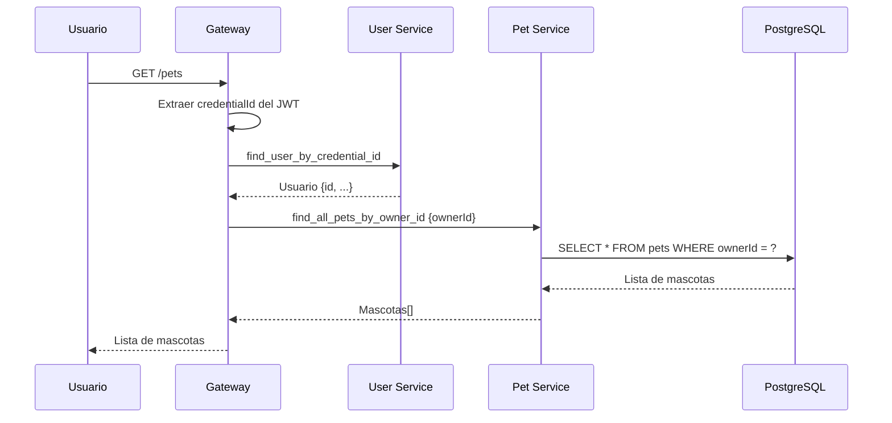
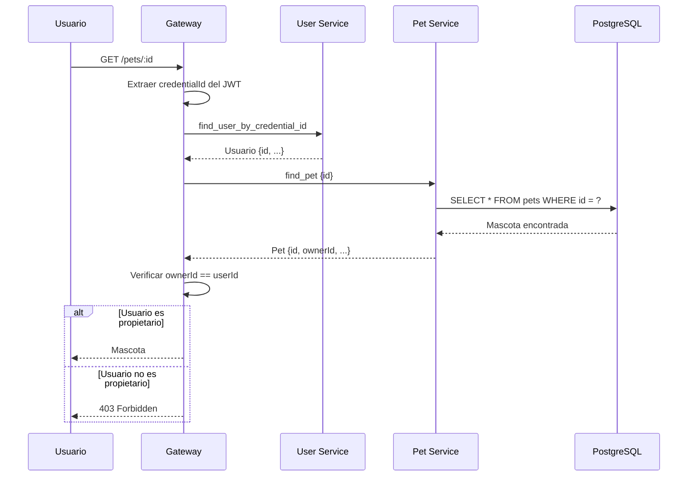
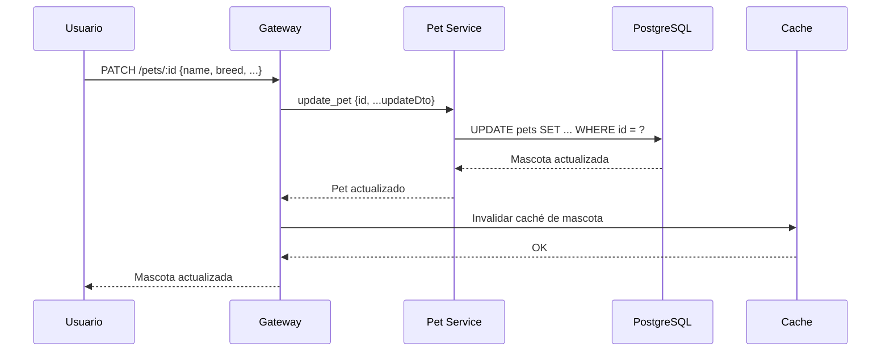
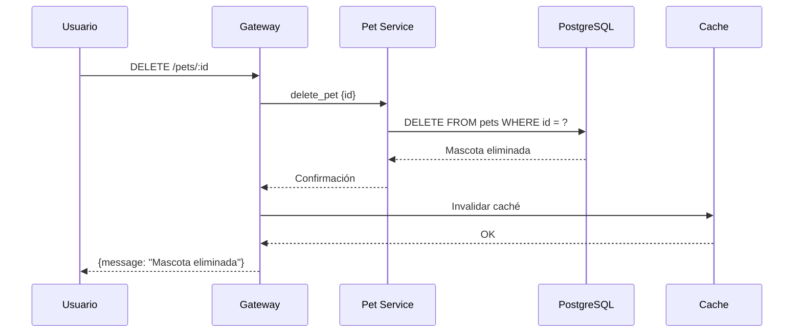

# Pet Service

## Descripción

Servicio de gestión de mascotas para la aplicación "Libreta Sanitaria de Mascotas". Maneja el registro, actualización, consulta y eliminación de mascotas asociadas a usuarios.

## Tecnologías

- **Framework**: NestJS
- **Base de Datos**: PostgreSQL (con TypeORM)
- **Mensajería**: RabbitMQ
- **Validación**: class-validator

## Arquitectura



## Casos de Uso

### Diagrama General de Casos de Uso



---

### UC-PET-01: Registrar Mascota

**Descripción**: Permite a un usuario registrar una nueva mascota sin foto.

**Actor**: Usuario

**Precondiciones**: 
- Usuario debe estar autenticado
- Usuario debe existir en User Service

**Flujo Principal**:
1. Usuario envía datos de la mascota (name, species, breed, birthDate, etc.)
2. Gateway obtiene usuario por credentialId
3. Gateway envía datos al Pet Service con ownerId
4. Pet Service valida datos
5. Pet Service crea mascota en base de datos
6. Pet Service retorna mascota creada

**Postcondiciones**:
- Mascota creada y asociada al usuario

**Diagrama de Secuencia**:



---

### UC-PET-02: Registrar Mascota con Foto (Saga)

**Descripción**: Registra una mascota con foto usando patrón Saga para garantizar consistencia.

**Actor**: Usuario

**Precondiciones**: 
- Usuario debe estar autenticado
- Foto debe ser válida (JPEG, PNG, WebP)
- Tamaño máximo: 10MB

**Flujo Principal**:
1. Usuario envía datos de mascota + foto
2. Gateway inicia Saga "CreatePetWithPhotoSaga"
3. **Paso 1**: Crear mascota en Pet Service
4. **Paso 2**: Subir foto al Media Service con entityType='pet' y entityId=petId
5. Saga retorna mascota y foto creadas
6. Gateway retorna resultado al usuario

**Flujo de Compensación** (si falla):
- Si falla paso 2: Eliminar mascota creada en paso 1
- Si falla paso 1: No hay compensación necesaria

**Postcondiciones**:
- Mascota creada
- Foto subida y asociada a la mascota

**Diagrama de Secuencia**:



---

### UC-PET-03: Listar Todas las Mascotas

**Descripción**: Obtiene lista de todas las mascotas (uso administrativo).

**Actor**: Sistema/Administrador

**Precondiciones**: 
- Ninguna

**Flujo Principal**:
1. Sistema solicita lista de todas las mascotas
2. Pet Service consulta base de datos
3. Pet Service retorna lista completa

**Postcondiciones**:
- Lista de mascotas retornada

---

### UC-PET-04: Listar Mis Mascotas

**Descripción**: Obtiene lista de mascotas del usuario autenticado.

**Actor**: Usuario

**Precondiciones**: 
- Usuario debe estar autenticado

**Flujo Principal**:
1. Usuario solicita sus mascotas
2. Gateway obtiene usuario por credentialId
3. Gateway solicita mascotas por ownerId al Pet Service
4. Pet Service consulta base de datos
5. Pet Service retorna lista de mascotas del usuario

**Postcondiciones**:
- Lista de mascotas del usuario retornada

**Diagrama de Secuencia**:



---

### UC-PET-05: Obtener Mascota por ID

**Descripción**: Obtiene información detallada de una mascota específica.

**Actor**: Usuario

**Precondiciones**: 
- Usuario debe estar autenticado
- Mascota debe existir
- Usuario debe ser el propietario de la mascota

**Flujo Principal**:
1. Usuario solicita mascota por ID
2. Gateway obtiene usuario por credentialId
3. Gateway solicita mascota al Pet Service
4. Pet Service retorna mascota
5. Gateway verifica que ownerId coincida con userId
6. Gateway retorna mascota al usuario

**Postcondiciones**:
- Datos de la mascota retornados

**Diagrama de Secuencia**:



---

### UC-PET-06: Actualizar Mascota

**Descripción**: Actualiza información de una mascota existente.

**Actor**: Usuario

**Precondiciones**: 
- Usuario debe estar autenticado
- Mascota debe existir
- Usuario debe ser el propietario

**Flujo Principal**:
1. Usuario envía datos actualizados
2. Gateway solicita actualización al Pet Service
3. Pet Service actualiza mascota en base de datos
4. Gateway invalida caché de la mascota
5. Pet Service retorna mascota actualizada

**Postcondiciones**:
- Mascota actualizada
- Caché invalidado

**Diagrama de Secuencia**:



---

### UC-PET-07: Validar Mascota

**Descripción**: Verifica si una mascota existe (usado internamente por otros servicios).

**Actor**: Sistema (Health Service)

**Precondiciones**: 
- Ninguna

**Flujo Principal**:
1. Sistema solicita validación de mascota por ID
2. Pet Service verifica existencia en base de datos
3. Pet Service retorna resultado de validación

**Postcondiciones**:
- Resultado de validación retornado

---

### UC-PET-08: Eliminar Mascota

**Descripción**: Elimina una mascota del sistema.

**Actor**: Usuario

**Precondiciones**: 
- Usuario debe estar autenticado
- Mascota debe existir
- Usuario debe ser el propietario

**Flujo Principal**:
1. Usuario solicita eliminar mascota
2. Gateway solicita eliminación al Pet Service
3. Pet Service elimina mascota de base de datos
4. Gateway invalida caché de la mascota
5. Pet Service retorna confirmación

**Postcondiciones**:
- Mascota eliminada
- Caché invalidado

**Diagrama de Secuencia**:



---

## Entidades Principales

### Pet Entity

```typescript
{
  id: string (UUID)
  ownerId: string (FK a User Service)
  name: string
  species: string (ej: "dog", "cat", "bird")
  breed?: string
  birthDate?: Date
  gender?: string ("male", "female", "unknown")
  weight?: number
  color?: string
  microchipId?: string
  mediaId?: string (FK a Media Service)
  createdAt: Date
  updatedAt: Date
}
```

## Message Patterns (RabbitMQ)

| Comando | Descripción |
|---------|-------------|
| `create_pet` | Crear nueva mascota |
| `find_all_pets` | Listar todas las mascotas |
| `find_pet` | Obtener mascota por ID |
| `find_all_pets_by_owner_id` | Obtener mascotas por propietario |
| `update_pet` | Actualizar mascota |
| `validate_pet` | Validar existencia de mascota |
| `delete_pet` | Eliminar mascota |

## API Endpoints (Gateway)

| Método | Endpoint | Descripción | Autenticación |
|--------|----------|-------------|---------------|
| POST | `/pets` | Crear mascota | ✅ JWT |
| POST | `/pets/with-photo` | Crear mascota con foto (Saga) | ✅ JWT |
| GET | `/pets` | Listar mis mascotas | ✅ JWT |
| GET | `/pets/:id` | Obtener mascota por ID | ✅ JWT |
| PATCH | `/pets/:id` | Actualizar mascota | ✅ JWT |
| DELETE | `/pets/:id` | Eliminar mascota | ✅ JWT |

## Sagas

### CreatePetWithPhotoSaga

**Propósito**: Garantizar consistencia al crear mascota con foto

**Pasos**:
1. Crear mascota en Pet Service
2. Subir foto al Media Service

**Compensaciones**:
- Si falla paso 2: Eliminar mascota creada

**Resiliencia**:
- Timeout: 3000ms por paso
- Reintentos: 2 intentos con delay incremental (300ms, 600ms)

## Variables de Entorno

```env
# Database
DATABASE_HOST=localhost
DATABASE_PORT=5432
DATABASE_USER=postgres
DATABASE_PASSWORD=postgres
DATABASE_NAME=pet_db

# RabbitMQ
RABBITMQ_URL=amqp://localhost:5672
```

## Instalación y Ejecución

```bash
# Instalar dependencias
npm install

# Ejecutar migraciones
npm run migration:run

# Modo desarrollo
npm run start:dev

# Modo producción
npm run build
npm run start:prod
```

## Puerto

- **3003** (TCP para RabbitMQ)
